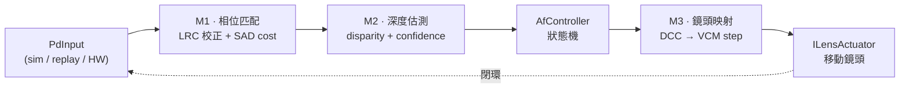
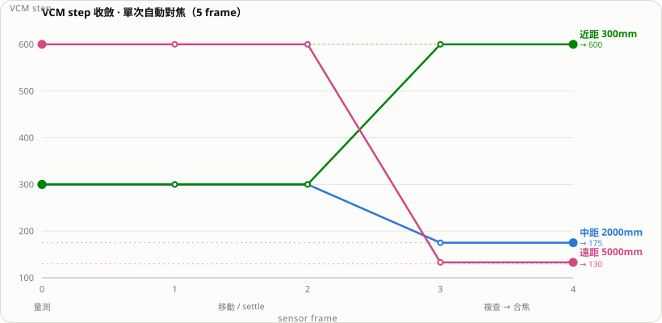

# PDAF_flow

相位偵測自動對焦（Phase-Detection Autofocus）的流程開發框架。以實際硬體應用的角度，掌控整個 AF 系統的設定，串接三個底層演算法模組，讓自動對焦以閉環方式收斂。目前沒有真實 sensor / VCM——內建光學模擬器閉環驅動整條 pipeline，另有 replay 來源可餵入實機錄製資料做離線分析。

架構參考市面典型產品方案（Qualcomm CamX stats / PDLib / HAF 的分層概念）。

## AF 流程



`AfController` 逐 sensor frame 驅動狀態機 `IDLE → MEASURING → MOVING → SETTLING → VERIFYING → FOCUSED / FAILED`，並輸出每個 frame 的紀錄。

## 四層架構

| 層 | 內容 | 說明 |
|---|---|---|
| **HAL** | `IPdDataSource`、`ILensActuator` | 光學模擬器與 replay 各是一組實作；接真硬體只需再寫一組，上層零改動 |
| **演算法** | M1 `SadCostEngine`、M2 `ParabolicDepthEstimator`、M3 `DccLensMapper` | 每個都是純介面 + 參考實作，可獨立替換 |
| **控制** | `PdafPipeline`（`IFocusEstimator`）、`AfController`、`AfConfig` | 控制器只依賴介面，組裝在 CLI 完成 |
| **應用** | `pdaf_cli`、`RunLogger` | 讀 config、跑 frame loop、輸出 CSV/summary |

公開介面在 `include/pdaf/`，參考實作在 `src/`。核心編為 `libpdaf`（static），CLI 與測試連結它。C++17、不依賴 OpenCV。

## 建置與執行

```bash
cmake -B build && cmake --build build
ctest --test-dir build --output-on-failure          # 全部測試

./build/apps/pdaf_cli --config config/default.json --out out
# 輸出 out/frames.csv（逐 frame 狀態/disparity/confidence/lens step）+ out/summary.txt
```

相依：GoogleTest v1.14.0（FetchContent 自動抓）、nlohmann/json v3.11.3（已 vendored 於 `third_party/`）。

## Demo 場景

`config/` 提供三種物距的收斂場景，全部在 5 個 frame 內對焦到位：

| Config | 物距 | 起始 step | 初始 disparity | 合焦 step | 最終誤差 |
|---|---|---|---|---|---|
| `default.json` | 2000mm | 300 | −2.5 | 175 | 0 step |
| `near.json` | 300mm | 300 | +6.0 | 600 | 0 step |
| `far.json` | 5000mm | 600 | −9.4（大離焦） | 130 | 3 step |



三條線各自從起始位置收斂到自己的合焦目標（虛線）：近距往前推、遠距往後拉，前三個 frame 量測＋移動/settle，第 4 frame 複查後合焦。互動版（hover tooltip、逐 frame 表格、light/dark 主題）在 [`docs/convergence.html`](docs/convergence.html)——下載後以瀏覽器開啟。

disparity 的正負號直接指出鏡頭該往哪走（近距往前、遠距往後）；遠距大離焦的殘留誤差來自單一 DCC 增益對大離焦的線性外插，仍在合焦門檻內，可用多錨點 DCC 表消除。

`--mode replay` 可改讀 `system.replay_dir` 下的 frame dump（`frame_0000.json` 起連號），用於單模組驗證與實機資料離線分析。

## 專案結構

```
include/pdaf/      公開介面與資料型別（types.h、hal/、algo/、control/）
src/               參考實作（algo/、control/、sim/、replay/）
apps/pdaf_cli/     CLI 組裝與 frame loop
tests/             GoogleTest（含 test_closed_loop.cpp 閉環整合測試）
config/            default / near / far 三種場景
docs/              設計 spec 與實作計畫
```

## 設計要點

- **曝光位置基準**：M3 換算 VCM step 時以「曝光當下」的鏡頭位置為基準，而非移動後的目前位置——對應實機 stats 的 pipeline 延遲，也是日後擴充連續對焦（CAF）的前提。
- **閉環自洽**：模擬器與 M3 共用同一 `dccInterp`，故模擬器的 ground truth 與 pipeline 的估算一致。
- **執行期不崩潰**：AF 執行期不丟例外，異常降級為 `confidence=0` 或狀態機 retry/fail；只有 config 載入會 fail-fast 並指出錯誤欄位。
- **活規格**：`tests/test_closed_loop.cpp` 以真實模擬器 + 真實 M1/M2/M3 端到端驗證收斂，是框架的活規格。

詳細設計見 `docs/superpowers/specs/`，逐步實作計畫見 `docs/superpowers/plans/`。
